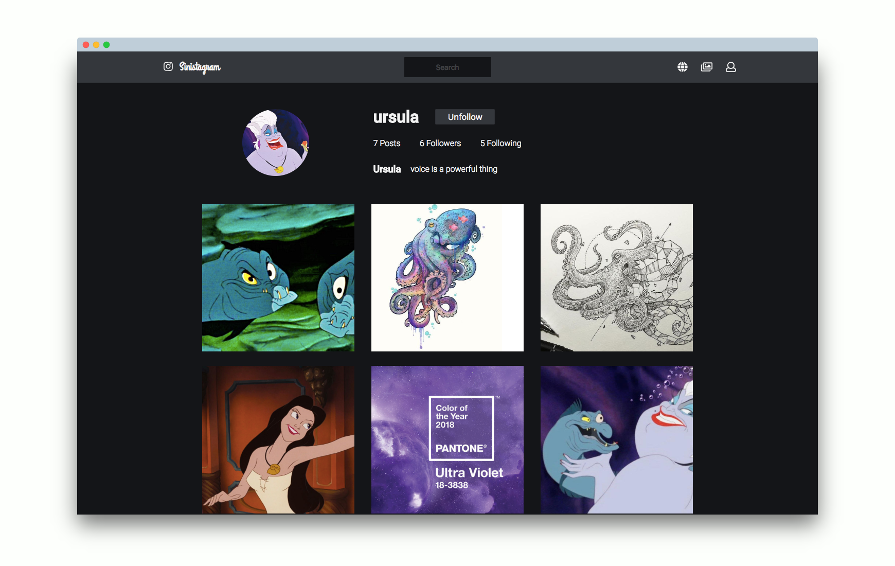
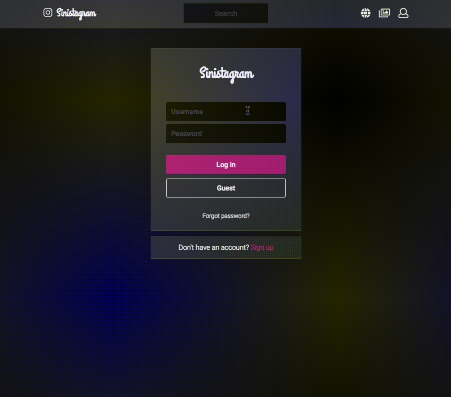

# Sinistagram 

A fullstack app for sharing your darkest, most evil photos with family and friends. It's the most sinister photo-sharing platform in the underworld, inspired by [Instagram](https://www.instagram.com/). Original project code can be viewed [here](https://github.com/helencho/insta-clone).  



## Features 

Log in and register securely using Bcrypt for authentication and verification of credentials. 



Look through your followers' photos in your homefeed. Click on a heart to like a photo. 


Curate the picture-perfect life. 


## Getting Started

Follow these instructions to get a copy of the fullstack app running on local.

### Installing Backend

```
git clone
cd backend
npm install
npm start
```

The backend will be running on http://localhost:3001. 

### Installing Frontend

Open a new terminal window.

```
git clone
cd frontend 
npm install
npm start 
```

Open http://localhost:3000/users to view the app in a browser.

## Built With

* [React](https://reactjs.org/) - JavaScript library 
* [Postgres](https://www.postgresql.org/) - database management 
* Express server
* CSS/HTML 


## Contributors from [Instaclone](https://github.com/helencho/insta-clone)

* [Greg](https://github.com/davisgreg1)
* [Princess](https://github.com/princessguerrero) 
* [Dori](https://github.com/doriguzman) 
* [Xavier](https://github.com/XavierC4Q)


## Future Works 

* Unfavorite photo 
* ~~Follow user~~
* Unfollow user 
* Post date 
* Logout 
* Search bar functionality 
* ~~Modals for edit, followers, following~~
* Render user's profile on username click from followers/following list 
