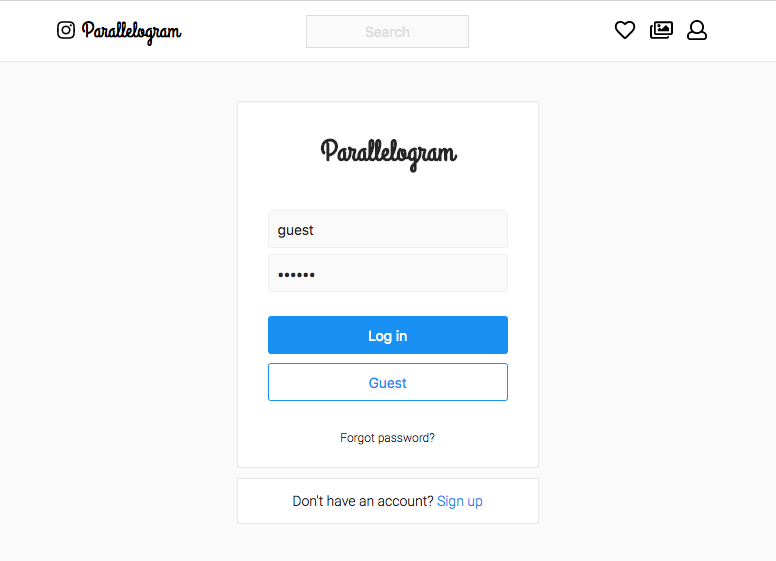
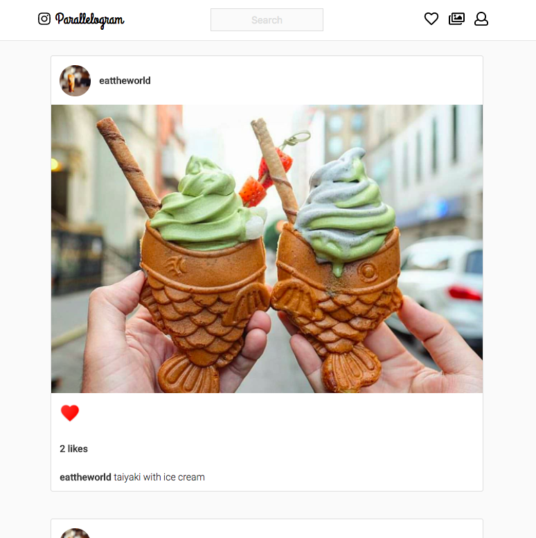
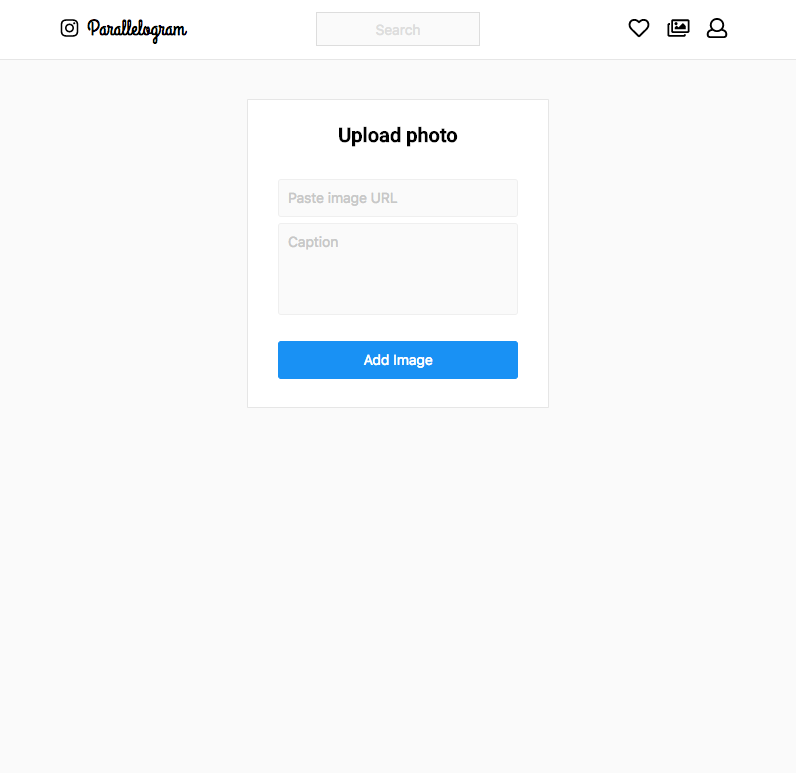
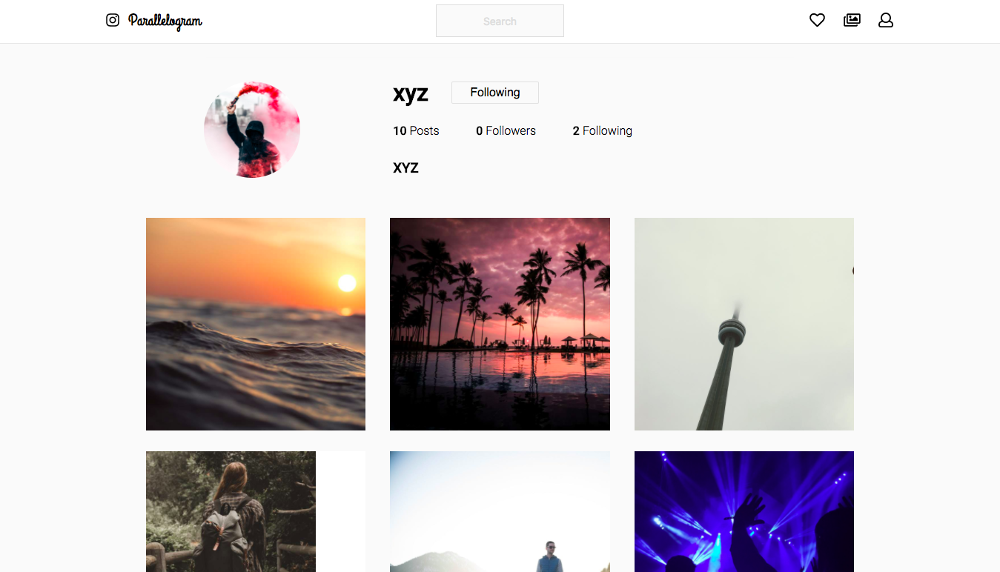

# Parallelogram 

A fullstack app for sharing photos with family and friends. It's your favorite photo-sharing platform in the universe, inspired by [Instagram](https://www.instagram.com/) from our sister universe. Original project code can be viewed [here](https://github.com/helencho/insta-clone).  


## Features 

Log in and register securely using Bcrypt for authentication and verification of credentials. Log in as a guest using the guest button. 




Browse through your homefeed based on who you follow. 




Upload a photo from the browser.




Curate the picture-perfect life. 




## Getting Started

Follow these instructions to get a copy of the fullstack app running on local for development and testing purposes.


### Prerequisities

Clone the repo. Go into terminal and navigate to the root folder. Initialize npm:

```
npm init
```

### Installing Backend

```
cd backend
npm install
npm start
```

The backend will be running on http://localhost:3001. 


### Installing Frontend

```
cd frontend 
npm install
npm start 
```


Open http://localhost:3000 to view the app in a browser.


## Built With
* [React](https://reactjs.org/) - JavaScript library 
* [Postgres](https://www.postgresql.org/) - database management 
* Express server
* CSS/HTML 


## Contributors from [Instaclone](https://github.com/helencho/insta-clone)
* [Greg](https://github.com/davisgreg1)
* [Princess](https://github.com/princessguerrero) 
* [Dori](https://github.com/doriguzman) 
* [Xavier](https://github.com/XavierC4Q)


## Future Works 
* Unfavorite photo 
* Follow user 
* Unfollow user 
* Post date 
* Logout 
* Search bar functionality 